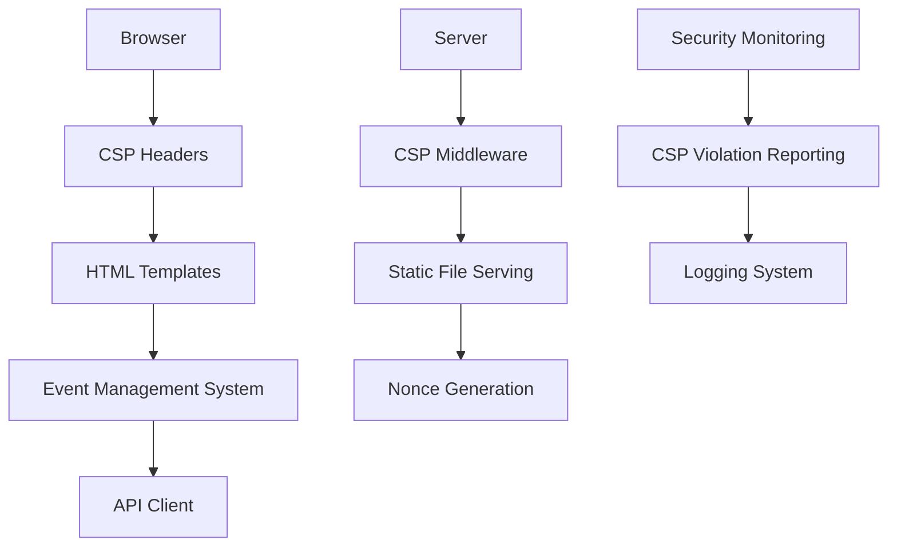

# Design Document

## Overview

The Frontend Security and CSP Compliance system addresses Content Security Policy violations in the ML model dashboard by refactoring inline event handlers, implementing proper CSP headers, and ensuring all frontend interactions comply with modern security standards. The solution maintains all existing functionality while significantly improving the application's security posture.

## Architecture

The security improvements follow a layered approach:



### Security Layers

1. **CSP Header Configuration**: Server-side middleware that sets appropriate CSP directives
2. **Event Management Refactoring**: Client-side system that replaces inline handlers with proper event listeners
3. **Nonce-based Script Loading**: Dynamic nonce generation for legitimate scripts
4. **Violation Monitoring**: CSP violation reporting and logging system

## Components and Interfaces

### CSP Middleware

**Responsibilities:**
- Generate and inject CSP headers for each request
- Create unique nonces for script and style tags
- Configure CSP directives based on environment
- Handle CSP violation reporting

**Key Configuration:**
```typescript
interface CSPConfig {
  defaultSrc: string[];
  scriptSrc: string[];
  styleSrc: string[];
  imgSrc: string[];
  connectSrc: string[];
  fontSrc: string[];
  reportUri?: string;
  reportTo?: string;
  nonce?: boolean;
}

interface CSPMiddleware {
  generateNonce(): string;
  buildCSPHeader(config: CSPConfig, nonce?: string): string;
  handleViolationReport(report: CSPViolationReport): void;
}
```

### Event Management System

**Responsibilities:**
- Centralized event listener management
- Event delegation for dynamic content
- Cleanup and memory management
- Cross-browser compatibility

**Key Interfaces:**
```typescript
interface EventManager {
  addEventListener(element: Element, event: string, handler: Function): void;
  removeEventListener(element: Element, event: string, handler: Function): void;
  delegateEvent(container: Element, selector: string, event: string, handler: Function): void;
  cleanup(): void;
}

interface ModelInteractionHandler {
  handleModelClick(modelId: string): void;
  handleModelDelete(modelId: string): void;
  handleModelEdit(modelId: string): void;
  handlePredictionTest(modelId: string, data: any): void;
}
```

### Template Security System

**Responsibilities:**
- Remove all inline event handlers from HTML
- Inject nonces into script and style tags
- Sanitize dynamic content
- Manage CSP-compliant styling

**Key Components:**
```typescript
interface TemplateProcessor {
  removeInlineHandlers(html: string): string;
  injectNonces(html: string, nonce: string): string;
  sanitizeContent(content: string): string;
}

interface StyleManager {
  addCSPCompliantStyles(element: Element, styles: CSSStyleDeclaration): void;
  removeInlineStyles(element: Element): void;
  applyClassBasedStyling(element: Element, className: string): void;
}
```

## Data Models

### CSP Configuration
```typescript
interface CSPDirectives {
  'default-src': string[];
  'script-src': string[];
  'style-src': string[];
  'img-src': string[];
  'connect-src': string[];
  'font-src': string[];
  'object-src': string[];
  'media-src': string[];
  'frame-src': string[];
  'worker-src': string[];
  'manifest-src': string[];
  'report-uri'?: string;
  'report-to'?: string;
}

interface NonceConfig {
  enabled: boolean;
  length: number;
  algorithm: 'base64' | 'hex';
  regenerateOnRequest: boolean;
}
```

### Event Handler Registry
```typescript
interface EventHandlerRegistry {
  handlers: Map<string, EventHandlerConfig>;
  delegatedEvents: Map<string, DelegatedEventConfig>;
}

interface EventHandlerConfig {
  element: string; // CSS selector
  event: string;
  handler: string; // function name
  options?: AddEventListenerOptions;
}

interface DelegatedEventConfig {
  container: string; // CSS selector
  target: string; // CSS selector for event delegation
  event: string;
  handler: string;
}
```

### Security Violation Report
```typescript
interface CSPViolationReport {
  'document-uri': string;
  referrer: string;
  'violated-directive': string;
  'effective-directive': string;
  'original-policy': string;
  disposition: 'enforce' | 'report';
  'blocked-uri': string;
  'line-number': number;
  'column-number': number;
  'source-file': string;
  'status-code': number;
  'script-sample': string;
}
```

## Error Handling

### CSP Violation Handling
- **Script Violations**: Log violation details and provide fallback functionality
- **Style Violations**: Apply alternative CSS classes and log violations
- **Image Violations**: Use placeholder images and report blocked sources
- **Connection Violations**: Implement retry logic for blocked API calls

### Event Handler Failures
- **Missing Handlers**: Provide graceful degradation and error logging
- **Event Binding Errors**: Implement fallback event attachment methods
- **Memory Leaks**: Automatic cleanup on page unload and navigation
- **Cross-browser Issues**: Feature detection and polyfill loading

### Error Response Handling
```typescript
interface SecurityErrorHandler {
  handleCSPViolation(violation: CSPViolationReport): void;
  handleEventBindingError(error: Error, element: Element): void;
  handleNonceGenerationError(error: Error): string;
  logSecurityEvent(event: SecurityEvent): void;
}

interface SecurityEvent {
  type: 'csp_violation' | 'event_error' | 'nonce_error';
  timestamp: Date;
  details: any;
  userAgent: string;
  url: string;
}
```

## Testing Strategy

### Security Testing
- **CSP Compliance**: Automated testing for CSP violations across all pages
- **Event Handler Testing**: Verify all interactive elements work without inline handlers
- **Nonce Validation**: Test nonce generation and injection in various scenarios
- **Cross-browser Security**: Test CSP compliance across different browsers

### Functional Testing
- **Model Interaction**: Verify all model management features work after refactoring
- **Dashboard Functionality**: Test complete user workflows without security errors
- **API Integration**: Ensure API calls continue to work with new CSP restrictions
- **Performance Impact**: Measure performance impact of security improvements

### Penetration Testing
- **XSS Prevention**: Test resistance to various XSS attack vectors
- **CSP Bypass Attempts**: Verify CSP cannot be easily bypassed
- **Content Injection**: Test protection against malicious content injection
- **Script Execution**: Verify unauthorized scripts cannot execute

## Implementation Considerations

### CSP Policy Configuration
```typescript
const strictCSPPolicy: CSPDirectives = {
  'default-src': ["'self'"],
  'script-src': ["'self'", "'nonce-{nonce}'"],
  'style-src': ["'self'", "'nonce-{nonce}'"],
  'img-src': ["'self'", "data:", "https:"],
  'connect-src': ["'self'"],
  'font-src': ["'self'"],
  'object-src': ["'none'"],
  'media-src': ["'self'"],
  'frame-src': ["'none'"],
  'worker-src': ["'self'"],
  'manifest-src': ["'self'"],
  'report-uri': ['/api/csp-violations']
};
```

### Event Management Patterns
- **Event Delegation**: Use container-based event delegation for dynamic content
- **Module Pattern**: Organize event handlers in modular, testable functions
- **Cleanup Strategy**: Implement proper event listener cleanup on page transitions
- **Performance Optimization**: Use passive event listeners where appropriate

### Nonce Implementation
- **Server-side Generation**: Generate cryptographically secure nonces per request
- **Template Injection**: Automatically inject nonces into script and style tags
- **Cache Considerations**: Ensure nonces don't interfere with caching strategies
- **Development Mode**: Provide relaxed CSP for development environments

### Browser Compatibility
- **Feature Detection**: Detect CSP support and provide fallbacks
- **Polyfill Strategy**: Load necessary polyfills for older browsers
- **Progressive Enhancement**: Ensure basic functionality works without CSP
- **Error Reporting**: Implement client-side error reporting for unsupported features