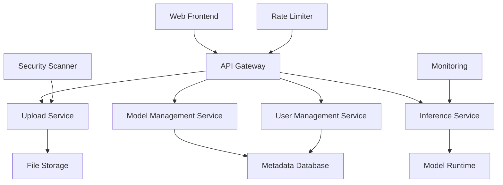

# Design Document

## Overview

The ML Model Upload and API Generation system is a web-based platform that allows users to upload trained machine learning models and automatically generates RESTful API endpoints for model inference. The system handles multiple model formats, provides secure file storage, implements user management, and offers real-time model serving capabilities.

## Architecture

The system follows a microservices architecture with the following key components:



### Core Services

1. **Upload Service**: Handles file uploads, validation, and storage
2. **Model Management Service**: Manages model metadata, user permissions, and lifecycle
3. **Inference Service**: Serves model predictions via dynamically generated endpoints
4. **User Management Service**: Handles authentication, authorization, and user data
5. **API Gateway**: Routes requests, handles rate limiting, and provides unified API access

## Components and Interfaces

### Upload Service

**Responsibilities:**
- File validation and format checking
- Malicious content scanning
- Secure file storage with encryption
- Model metadata extraction

**Key Interfaces:**
```typescript
interface UploadRequest {
  file: File;
  modelName: string;
  description: string;
  userId: string;
}

interface UploadResponse {
  modelId: string;
  endpointUrl: string;
  status: 'success' | 'error';
  message: string;
}
```

### Model Management Service

**Responsibilities:**
- Model metadata CRUD operations
- User model associations
- Model lifecycle management
- Usage analytics tracking

**Key Interfaces:**
```typescript
interface ModelMetadata {
  id: string;
  name: string;
  description: string;
  userId: string;
  fileFormat: string;
  filePath: string;
  endpointUrl: string;
  createdAt: Date;
  lastUsed: Date;
  requestCount: number;
  status: 'active' | 'inactive' | 'archived';
}
```

### Inference Service

**Responsibilities:**
- Dynamic model loading and caching
- Request preprocessing and validation
- Model prediction execution
- Response formatting

**Key Interfaces:**
```typescript
interface PredictionRequest {
  modelId: string;
  inputData: any;
  apiKey?: string;
}

interface PredictionResponse {
  predictions: any;
  confidence?: number;
  processingTime: number;
  status: 'success' | 'error';
  error?: string;
}
```

## Data Models

### User Model
```typescript
interface User {
  id: string;
  email: string;
  apiKey: string;
  createdAt: Date;
  subscription: 'free' | 'premium';
  rateLimits: {
    requestsPerMinute: number;
    modelsLimit: number;
  };
}
```

### Model File Storage
```typescript
interface StoredModel {
  id: string;
  originalName: string;
  storagePath: string;
  fileSize: number;
  checksum: string;
  encryptionKey: string;
  format: ModelFormat;
}

enum ModelFormat {
  PICKLE = 'pkl',
  JOBLIB = 'joblib',
  KERAS = 'h5',
  ONNX = 'onnx',
  PYTORCH = 'pt',
  PYTORCH_STATE = 'pth'
}
```

### API Endpoint Configuration
```typescript
interface EndpointConfig {
  modelId: string;
  url: string;
  inputSchema: JSONSchema;
  outputSchema: JSONSchema;
  rateLimits: RateLimitConfig;
  authRequired: boolean;
}
```

## Error Handling

### Upload Errors
- **File Format Validation**: Return 400 with supported formats list
- **File Size Exceeded**: Return 413 with size limits
- **Malicious Content**: Return 400 with security violation message
- **Storage Failure**: Return 500 with retry instructions

### Inference Errors
- **Model Not Found**: Return 404 with model ID
- **Invalid Input**: Return 400 with schema validation errors
- **Model Loading Failure**: Return 500 with temporary unavailability message
- **Prediction Timeout**: Return 504 with timeout information
- **Rate Limit Exceeded**: Return 429 with retry-after header

### Error Response Format
```typescript
interface ErrorResponse {
  error: {
    code: string;
    message: string;
    details?: any;
    timestamp: string;
  };
}
```

## Testing Strategy

### Unit Testing
- **Upload Service**: File validation, storage operations, metadata extraction
- **Model Management**: CRUD operations, user associations, lifecycle management
- **Inference Service**: Model loading, prediction execution, response formatting
- **Security Components**: Authentication, authorization, rate limiting

### Integration Testing
- **End-to-End Upload Flow**: File upload through API endpoint generation
- **Prediction Workflow**: Request processing through response delivery
- **User Management**: Registration, authentication, and model access control
- **Error Scenarios**: Invalid inputs, system failures, and recovery

### Performance Testing
- **Concurrent Uploads**: Multiple users uploading simultaneously
- **High-Volume Inference**: Stress testing model endpoints
- **Model Loading**: Cold start performance and caching effectiveness
- **Database Performance**: Query optimization under load

### Security Testing
- **File Upload Security**: Malicious file detection and handling
- **API Security**: Authentication bypass attempts and injection attacks
- **Rate Limiting**: Abuse prevention and fair usage enforcement
- **Data Protection**: Encryption at rest and in transit

## Implementation Considerations

### Model Format Support
- **Scikit-learn**: .pkl, .joblib files with pickle/joblib loading
- **TensorFlow/Keras**: .h5 files with tf.keras.models.load_model
- **PyTorch**: .pt, .pth files with torch.load
- **ONNX**: .onnx files with onnxruntime

### Scalability
- **Horizontal Scaling**: Stateless services with load balancing
- **Model Caching**: Redis-based caching for frequently used models
- **Async Processing**: Queue-based model loading and prediction
- **CDN Integration**: Static asset delivery and global distribution

### Security Measures
- **File Scanning**: Antivirus integration and content analysis
- **Encryption**: AES-256 for file storage, TLS for transmission
- **Access Control**: JWT-based authentication with role-based permissions
- **Audit Logging**: Comprehensive logging for security monitoring